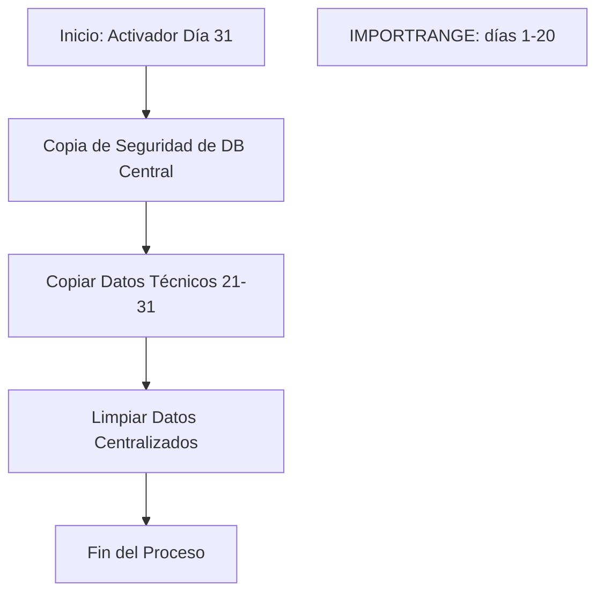
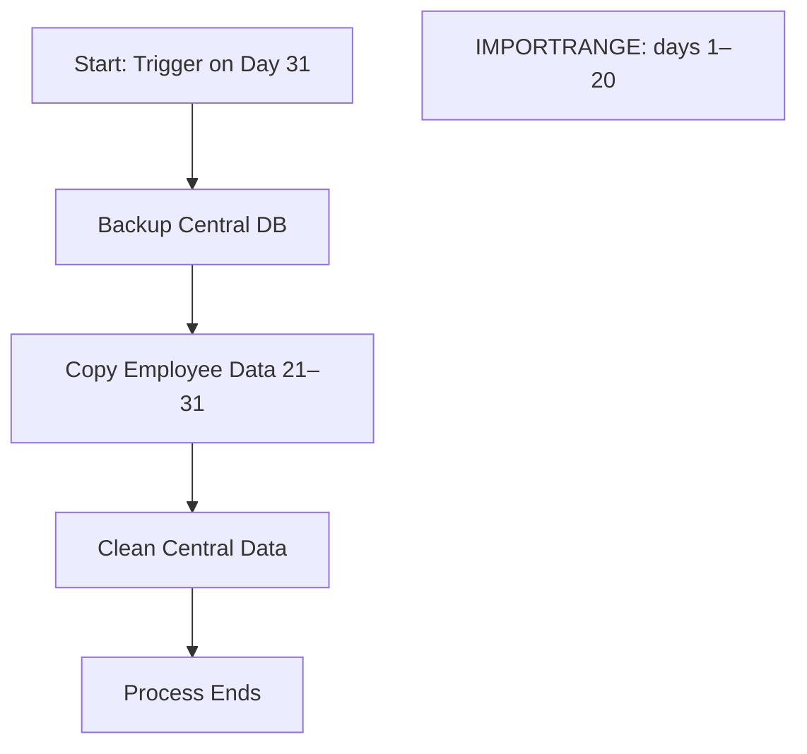
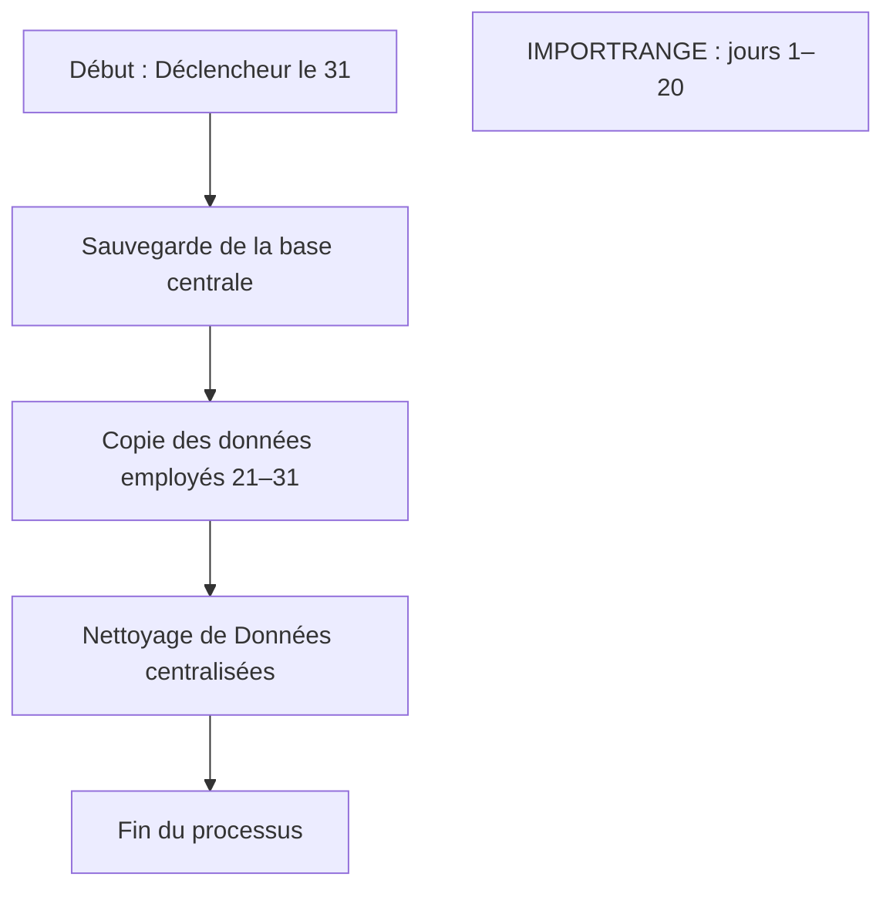

<details>
<summary>📘 Español</summary>

# 🚀 Automatización de Gestión de Actividad con Google Apps Script

Este proyecto ofrece una solución práctica y escalable para automatizar la gestión mensual de datos de producción entre hojas de Google Sheets, reduciendo errores manuales y ahorrando tiempo operativo.

> ✅ Pensado para pequeñas empresas que trabajan con plantillas de Google Sheets para controlar la actividad de su equipo técnico.

---

## ✨ Descripción General

El script automatiza el flujo de datos entre una hoja central de seguimiento y las hojas individuales de facturación de cada empleado. También genera copias de seguridad y prepara el sistema para un nuevo ciclo mensual.

---

## 🎯 Funcionalidades Principales

- 🔁 **Transferencia automática de datos (21 al 31)**: Copia los registros de producción del final del mes desde la hoja central a las hojas individuales de cada empleado.
- 💾 **Copias de seguridad mensuales**: Guarda automáticamente una copia de la hoja central antes de cualquier modificación.
- 🧹 **Limpieza selectiva**: Borra únicamente los datos de producción del mes anterior en la hoja central, preservando el resto de la información.
- 🔗 **Flujo híbrido**: Complementa el script con fórmulas `IMPORTRANGE` para mantener sincronización automática del día 1 al 20 del mes.

---

## ⚙️ Flujo del Proceso



---

## 🛠️ Instrucciones de Uso

1. **Pega el Script**  
   En tu hoja de Google: Extensiones → Apps Script → Reemplaza el contenido con el script de este repositorio.

2. **Edita el ID de Hoja de Origen**  
   En el script, reemplaza:
   ```js
   const ID_HOJA_ORIGEN = 'TU_ID_DE_LA_HOJA_ORIGEN';
   ```

3. **Crea la pestaña `Configuración` en la hoja de origen**  
   - `B3`: ID de la hoja de destino  
   - `B4`: ID de la carpeta en Drive para las copias  
   - Desde `B7` en adelante: nombres exactos de las pestañas de empleados

4. **Configura el Activador Automático**  
   En el editor de Apps Script, añade un disparador para `ejecutarProcesoMensual`, tipo **basado en el tiempo**, y establece el **día 31**.

5. **Concede permisos**  
   Al ejecutar por primera vez, acepta los permisos solicitados por Google.
    Asegúrate de usar para todo la misma cuenta de google
---

## ✅ Beneficios

- ⏱️ Ahorra tiempo administrativo
- 🧮 Elimina errores humanos en la gestión de datos
- 💾 Asegura historial de actividad con backups automáticos
- 📈 Escalable para más empleados sin aumentar carga manual

---

## 🚀 Mejoras Futuras (Propuestas)

- 📧 Notificaciones por correo al finalizar el proceso
- 📊 Resúmenes automáticos por técnico
- ✅ Validaciones previas antes de copiar/limpiar

---

## 👩‍💻 Sobre este proyecto

Este script se desarrolló como solución real para una empresa familiar de 12 empleados. Está pensado para ayudar a equipos pequeños a mantener su operación ordenada sin depender de herramientas de pago ni procesos manuales repetitivos.

</details>
<details>
<summary>📘 English</summary>

# 🚀 Activity Management Automation with Google Apps Script

This project offers a practical and scalable solution to automate the monthly management of production data across Google Sheets, reducing manual errors and saving operational time.

> ✅ Designed for small businesses using Google Sheets templates to manage their technical teams’ activity.

---

## ✨ Overview

The script automates data flow between a central tracking sheet and individual billing sheets per employee. It also creates backups and prepares the system for a new monthly cycle.

---

## 🎯 Key Features

- 🔁 **Automated data transfer (21st to 31st)**: Moves production records from the central sheet to each employee’s billing sheet.
- 💾 **Monthly backups**: Automatically saves a full backup of the central sheet before any cleanup.
- 🧹 **Selective cleanup**: Clears only last month’s production data from the central sheet, preserving the rest.
- 🔗 **Hybrid flow**: Combines with `IMPORTRANGE` formulas to sync data from the 1st to the 20th automatically.

---

## ⚙️ Process Flow



---

## 🛠️ Setup Instructions

1. **Paste the Script**  
   In your Google Sheet: Extensions → Apps Script → Replace the content with the code from this repo.

2. **Set the Source Sheet ID**  
   In the script, update:
   ```js
   const ID_HOJA_ORIGEN = 'YOUR_SOURCE_SHEET_ID';
   ```

3. **Create the `Configuración` tab in your source sheet**  
   - `B3`: ID of the destination sheet  
   - `B4`: ID of your Google Drive folder for backups  
   - From `B7` onwards: exact names of each employee's tab

4. **Set up the automatic trigger**  
   In the Apps Script editor, go to the clock icon and create a trigger for `ejecutarProcesoMensual`, choose **Time-based**, and schedule it for **Day 31**.

5. **Grant Permissions**  
   On the first run, Google will ask for authorization.  
   Make sure to use the same Google account for all files and the script.

---

## ✅ Benefits

- ⏱️ Saves valuable admin time
- 🧮 Eliminates human errors in data management
- 💾 Ensures monthly data history with backups
- 📈 Easily scalable as the team grows

---

## 🚀 Future Improvements (Suggestions)

- 📧 Email confirmation after process runs
- 📊 Auto-generated activity summaries per employee
- ✅ Pre-check validations before cleaning or transferring data

---

## 👩‍💻 About This Project

This script was created as a real-world solution for a family business with 12 employees. It’s tailored for small teams looking for reliable organization without relying on paid tools or repetitive manual processes.

</details>

<details>
<summary>📘 Français</summary>

# 🚀 Automatisation de la gestion d'activité avec Google Apps Script

Ce projet propose une solution pratique et évolutive pour automatiser la gestion mensuelle des données de production dans Google Sheets, en réduisant les erreurs manuelles et en économisant du temps de gestion.

> ✅ Conçu pour les petites entreprises utilisant des modèles Google Sheets pour suivre l'activité de leur équipe technique.

---

## ✨ Vue d'ensemble

Le script automatise le transfert de données entre une feuille centrale de suivi et les feuilles de facturation individuelles de chaque employé. Il crée également des sauvegardes et prépare le système pour un nouveau cycle mensuel.

---

## 🎯 Fonctionnalités principales

- 🔁 **Transfert automatique des données (du 21 au 31)** : Transfère les enregistrements de production de la feuille centrale vers les feuilles individuelles.
- 💾 **Sauvegardes mensuelles** : Enregistre automatiquement une copie complète de la feuille centrale avant toute modification.
- 🧹 **Nettoyage sélectif** : Supprime uniquement les données du mois précédent tout en conservant les autres informations.
- 🔗 **Flux hybride** : Combine avec les formules `IMPORTRANGE` pour synchroniser automatiquement les données du 1er au 20 du mois.

---

## ⚙️ Schéma du processus



---

## 🛠️ Instructions de configuration

1. **Coller le script**  
   Dans votre feuille Google : Extensions → Apps Script → Remplacez le contenu par le script de ce dépôt.

2. **Définir l'ID de la feuille source**  
   Dans le script, modifiez :
   ```js
   const ID_HOJA_ORIGEN = 'VOTRE_ID_FEUILLE_SOURCE';
   ```

3. **Créer l’onglet `Configuración` dans la feuille source**  
   - `B3` : ID de la feuille de destination  
   - `B4` : ID du dossier Google Drive pour les sauvegardes  
   - À partir de `B7` : noms exacts des feuilles des employés

4. **Configurer le déclencheur automatique**  
   Dans l’éditeur Apps Script, cliquez sur l’icône de l’horloge et ajoutez un déclencheur pour `ejecutarProcesoMensual`, de type **basé sur le temps**, programmé pour le **31 du mois**.

5. **Accorder les autorisations**  
   Lors du premier lancement, Google demandera des autorisations.  
   Assurez-vous d'utiliser le **même compte Google** pour tous les fichiers et le script.

---

## ✅ Avantages

- ⏱️ Gain de temps de gestion
- 🧮 Élimine les erreurs humaines dans le traitement des données
- 💾 Historique mensuel sécurisé grâce aux sauvegardes
- 📈 Facilement adaptable à une équipe en expansion

---

## 🚀 Améliorations futures (suggestions)

- 📧 Notification par email après exécution
- 📊 Résumés automatiques d’activité par employé
- ✅ Validations avant suppression ou transfert

---

## 👩‍💻 À propos du projet

Ce script a été développé pour répondre aux besoins réels d’une entreprise familiale de 12 salariés. Il vise à offrir une solution fiable et gratuite aux petites équipes ne souhaitant pas dépendre d’outils payants ni de processus manuels répétitifs.

</details>
